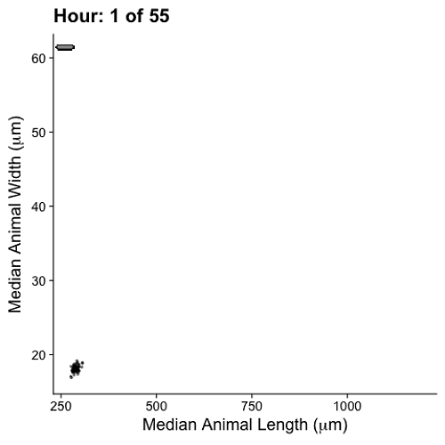

# Changes in body shape implicate cuticle stretch in *C. elegans* growth control
Growth control establishes organism size, requiring mechanisms to sense and adjust growth during development. Studies of single cells revealed that size homeostasis uses distinct control methods. In multicellular organisms, mechanisms that regulate single cell growth must integrate control across organs and tissues during development to generate adult size and shape. We leveraged the roundworm *Caenorhabditis elegans* as a scalable and tractable model to collect precise growth measurements of thousands of individuals, measure feeding behavior, and quantify changes in animal size and shape during a densely sampled developmental time course. As animals transitioned from one developmental stage to the next, we observed changes in body aspect ratio while body volume remained constant. Then, we modeled a physical mechanism by which constraints on cuticle stretch could cause changes in *C. elegans* body shape. The model-predicted shape changes are consistent with those observed in the data. Theoretically, cuticle stretch could be sensed by the animal to initiate larval-stage transitions, providing a means for physical constraints to influence developmental timing and growth rate in *C. elegans*.

## Files
- **S1 File. Incubator temperature data.** Temperature recordings of each position within the shaking incubator used for growth experiment
- **S2 File. COPAS BIOSORT growth data.** Raw growth data collected from the COPAS BIOSORT and processed using the easysorter R package to compile information from each well
- **S3 File. Pruned COPAS BIOSORT growth data.** Processed data from the COPAS BIOSORT following implementation of the mclust R package and removal of clusters containing non-animal objects
- **S4 File. Image growth data.** Manual measurements of animal size acquired from images
- **S5 File. Model Derivations.**
